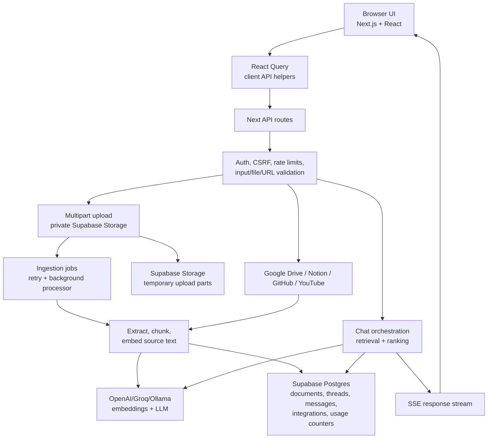

# 🧠 AI Notebook (Chat with Your Sources)

An AI-powered research assistant that lets you chat with your own data - including PDFs, web articles, YouTube videos, GitHub repos, Notion, and Google Drive - using a powerful Retrieval-Augmented Generation (RAG) pipeline.

---

## 🚀 Features

### 📚 Multi-Source Ingestion

* 📄 Upload PDFs and multiple file types (txt, md, csv, json, code, zip)
* 📦 Multipart uploads with a 10 MB hard cap
* 🧾 Background ingestion jobs with retry/status tracking
* 🌐 Add web URLs and parse articles
* 🎥 Add YouTube videos and process transcripts
* 💻 Ingest GitHub repositories
* 📝 Sync Notion pages
* 📁 Sync Google Drive files
* ✍️ Paste raw text

---

### 🤖 AI Chat (RAG)

* 💬 Persistent multi-thread chats
* 🧵 5-chat limit per user
* ✅ Multi-select sources for scoped search
* 🔎 Semantic search using embeddings (pgvector)
* 📚 Source-grounded answers with structured context
* ⚡ SSE streaming responses
* 📜 Message pagination and virtualization for large threads
* 🧠 Improved retrieval:

  * smarter chunking (with overlap)
  * similarity ranking
  * deduplication
  * top-k selection

---

### 🔄 Sync System

* 🔄 Manual sync for all integrations
* ⏱️ Background sync via cron (Supabase)
* 📊 Tracks last synced state per integration

---

### 🔐 Authentication

* Email magic-link login
* Google OAuth (Supabase Auth)
* GitHub OAuth (Supabase Auth)
* Secure session handling
* User-isolated data (multi-tenant)

### 🛡️ Security Baseline

* Security headers configured in `next.config.ts`
* Auth required for ingestion, sources, integrations, sync, chat, and test APIs
* Same-origin CSRF enforcement for cookie-auth mutating routes
* DB-backed rate limits and daily quotas for expensive server actions
* Server-side API keys only; frontend uses Supabase anon key only
* File uploads restricted by extension, MIME type, size, and content signatures
* PDF, ZIP, and text payloads receive additional defensive validation
* Public URL ingestion rejects local/private network targets and unsafe redirects
* URL ingestion enforces timeout, redirect, response-size, and content-type limits
* Upload storage is private and temporary; public file URLs are not exposed
* Integration tokens are encrypted at rest with `INTEGRATION_TOKEN_ENCRYPTION_KEY`
* Chat source responses return safe metadata only, not raw document chunks

Searchable source content is not end-to-end encrypted in this architecture.
The server must read extracted source text to chunk, embed, and retrieve it.
Sensitive OAuth/integration tokens are encrypted at rest, but documents and
messages should be treated as server-readable application data unless the
architecture changes to client-side encryption without server-side search.

---

### 🌍 Environment Isolation

* Separate **dev vs prod data** using `env` column
* Prevents local testing from polluting production
* Ensures clean embeddings + retrieval

---

### 🎨 UI / UX

* 📱 Mobile responsive layout
* 🧭 Redesigned sidebar (clean + organized)
* 🖱️ Drag and drop file upload
* 🧩 shadcn dialog for link/text source upload
* 🔄 Unified “Sync Connected Apps” action
* 🔔 Toast notifications (Sonner)
* ♿ Accessible labels and keyboard-friendly controls
* 🌍 Localisation foundation with `next-intl` and English messages

---

## 🏗️ Tech Stack

### Frontend

* Next.js (App Router)
* React
* Tailwind CSS
* shadcn/ui
* React Query
* next-intl
* Sonner

### Backend

* Next.js API Routes
* Supabase (Postgres + pgvector + Auth)
* Supabase Storage for temporary private upload parts

### Quality

* ESLint
* TypeScript
* Jest + Testing Library
* Playwright
* GitHub Actions CI

### AI / ML

* OpenAI (embeddings)
* Groq / OpenAI / Ollama (LLMs)
* RAG (Retrieval-Augmented Generation)

---

## 🧠 Architecture Overview



Source ingestion validates input, extracts plain text, chunks content, creates
embeddings, and stores user/env-scoped vectors in Supabase. Chat requests load
thread history, retrieve selected-source context, call the configured LLM, and
stream answers back to the UI with SSE.

---

## ⚙️ Setup Instructions

### 1. Clone repo

```bash
git clone https://github.com/Mayuresh162/ai-notebook.git
cd ai-notebook
```

---

### 2. Install dependencies

```bash
npm install
```

---

### 3. Setup Environment Variables

Create `.env.local`:

```bash
NEXT_PUBLIC_SUPABASE_URL=your_url
NEXT_PUBLIC_SUPABASE_ANON_KEY=your_key
SUPABASE_SERVICE_ROLE_KEY=your_service_key
# Existing projects may use SUPABASE_SERVICE_KEY instead.
DATA_ENV=local
OAUTH_STATE_SECRET=your_random_secret
INTEGRATION_TOKEN_ENCRYPTION_KEY=your_32_byte_or_longer_secret
INGESTION_CRON_SECRET=your_random_cron_secret
APP_URL=http://localhost:3000

# Integration OAuth
# Used by Google Drive integration routes, not Supabase Google login.
GOOGLE_CLIENT_ID=your_google_client_id
GOOGLE_CLIENT_SECRET=your_google_client_secret

# Used by Notion integration routes.
NOTION_CLIENT_ID=your_notion_client_id
NOTION_CLIENT_SECRET=your_notion_client_secret

# LLM Providers (optional)
OPENAI_API_KEY=your_key
OPENAI_EMBEDDING_MODEL=text-embedding-3-small
GROQ_API_KEY=your_key
```

Use separate Supabase projects for local/staging and production whenever
possible. `DATA_ENV` is stored with document embeddings and used during search,
so keep it explicit in every deployed environment, for example `local`,
`staging`, or `prod`.

Configure login providers in the Supabase Auth dashboard. Enable Google and
GitHub providers there for app login, then add these redirect URLs:

```txt
http://localhost:3000/auth/callback
https://YOUR_DOMAIN.com/auth/callback
```

Local `.env*` files must never be committed. Rotate any key that has been
exposed in terminal logs, screenshots, commits, or shared chat transcripts.

---

### 4. Setup Supabase

Review and apply `supabase/schema.sql` manually in Supabase SQL editor or your
migration tooling. The application does not run schema changes automatically.

The schema includes:

* `documents` and `integrations`
* `threads` and `messages`
* `source_upload_sessions`, `source_upload_parts`, and `source_ingestion_jobs`
* `server_usage_counters`
* `match_documents`, `delete_documents_by_names`, and `consume_usage_limit`
* RLS policies, indexes, grants, and private `source-upload-parts` storage setup

👉 Ensure embedding dimensions match your model. The default `text-embedding-3-small` uses 1536 dimensions.

---

### 5. Run locally

```bash
npm run dev
```

### 6. Test and verify

```bash
npm run lint
npx tsc --noEmit
npm run test:unit -- --runInBand
npm run test:coverage -- --runInBand
npm run build
```

Playwright smoke tests are available when local browser/server environment
variables are ready:

```bash
npm run test:e2e
```

---

## 🧪 Usage

* Upload or connect sources
* Sync integrations (Notion / Drive)
* Sources appear in sidebar
* Ask questions in chat
* Get grounded answers with source references

---

## 🧪 Testing, Coverage, and CI

* `npm run test:unit` runs Jest unit and component tests
* `npm run test:coverage` writes text, lcov, and json-summary coverage reports
* `npm run test:e2e` runs Playwright browser smoke tests
* Component tests use Testing Library for fast UI behavior checks
* Playwright tests cover browser-level smoke flows without real OAuth/LLM calls by default
* GitHub Actions runs lint, typecheck, unit/component tests, and coverage on PRs and pushes to `main`

---

## ♿ Accessibility and Localisation

* Important icon-only controls have accessible labels
* Source multi-select uses checkbox semantics
* Dialog inputs are labelled and validation messages are associated with fields
* Mobile drawer supports keyboard Escape close
* `next-intl` is configured with English messages in `messages/en.json`

---

## 🌐 Deployment

Recommended: Vercel

Steps:

* Push to GitHub
* Import into Vercel
* Add environment variables
* Deploy

Production builds use the standard Next.js build command:

```bash
npm run build
```

GitHub Actions handles quality checks. Vercel remains responsible for deployment.

---

## ⚠️ Notes

* Ollama won’t work on Vercel (local only)
* Use OpenAI / Groq in production
* Ensure embedding model consistency
* Set `DATA_ENV` explicitly for every environment before ingesting sources
* Supabase cron or another trusted scheduler should call `/api/ingestion/process`
  with `INGESTION_CRON_SECRET` for background upload indexing
* Keep `SUPABASE_SERVICE_ROLE_KEY` / `SUPABASE_SERVICE_KEY`, `OPENAI_API_KEY`,
  `GROQ_API_KEY`, Google Drive and Notion OAuth secrets,
  `INTEGRATION_TOKEN_ENCRYPTION_KEY`, and `INGESTION_CRON_SECRET` server-side only
* Add a privacy policy before collecting real user data

---

## 🚦 Launch Security Checklist

Before deploying publicly:

* Confirm Supabase Row Level Security policies isolate documents, integrations, threads, messages, upload sessions, upload parts, and ingestion jobs by `user_id`
* Confirm production environment variables are configured in Vercel and no `.env*` files are committed
* Review OAuth redirect URLs for the exact production domain
* Enable Google and GitHub providers in Supabase Auth before testing SSO
* Confirm upload storage buckets remain private and signed URLs are only created after ownership checks
* Run `npm run lint`, `npx tsc --noEmit`, `npm run test:coverage -- --runInBand`, and `npm run build`
* Test upload, URL, YouTube, GitHub, Notion, Google Drive, and chat routes while signed out and signed in
* Review API logs to ensure secrets, tokens, document content, and user data are not logged

---

## ⭐ If you like this project

Give it a star on GitHub!
